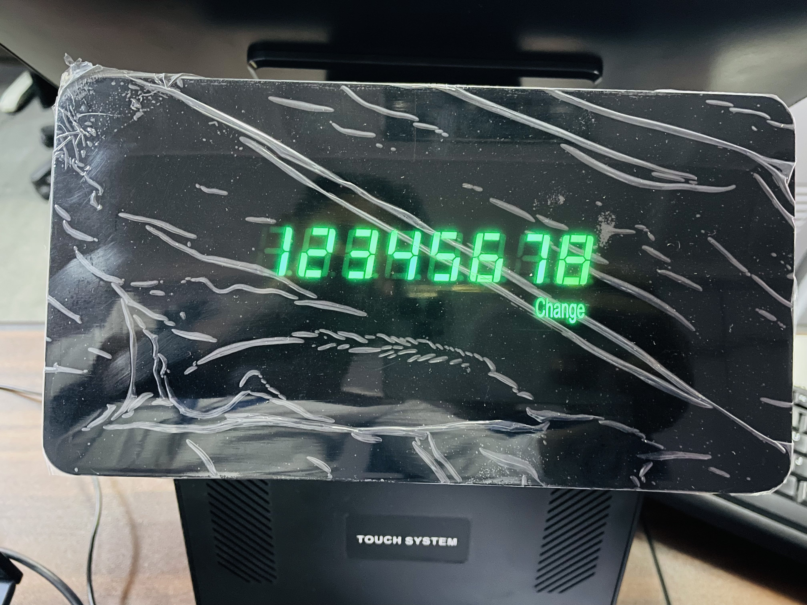
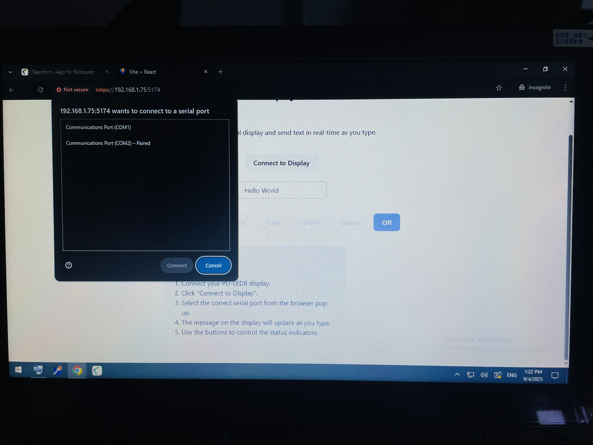
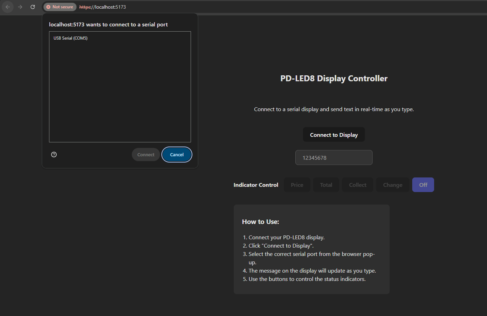

# PD-LED8 React Controller

This project is a React-based web interface to control a PD-LED8 customer display.



## Features

- Easy to use interface for sending commands to the LED display.
- Real-time preview of the display content.

## Hardware Connection

To connect the display, please follow the instructions in the images below:

**Connection Setup 1:**


**Connection Setup 2:**


_Note: Please refer to the `LED8 custom display command.pdf` for more details on the display commands._

## Getting Started

These instructions will get you a copy of the project up and running on your local machine for development and testing purposes.

### Prerequisites

- Node.js and npm installed on your machine.
- The PD-LED8 display connected to your system.

### Installation

1.  Clone the repository.
2.  Navigate to the project directory:
    ```sh
    cd pd-led8-react-controller
    ```
3.  Install the dependencies:
    ```sh
    npm install
    ```

### Running the Application

To run the application in development mode:

```sh
npm run dev
```

This will open the controller interface in your default web browser.

### Building for Production

To create a production build:

```sh
npm run build
```

This will create a `dist` folder with the optimized files for deployment.

## Author

- **Nadun Malinda Jayaweera**
